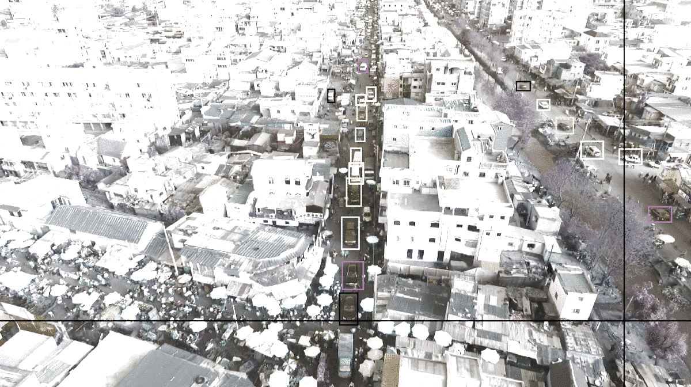

# Label reformatter

Labels reformatter for car detected from pictures taken from a moving UAV (drone)

## Usage

The orginal labels are in the folder ```original_lables``` and the updated and reformatted labels are in the folder ```new_label```

## An Example
The original label 

```
22
391 743 456 829 car
288 677 355 785 car
144 545 240 606 car
63 529 144 597 car
48 1008 144 1059 car
825 816 940 869 car
1163 768 1274 839 car
1488 648 1589 723 car
643 624 721 743 car
631 401 681 480 car
311 480 391 504 car
303 495 384 543 car
193 462 288 528 car
414 384 480 410 car
624 336 672 384 car
600 270 672 336 car
576 240 600 270 car
599 240 639 263 car
576 149 599 192 car
576 117 587 151 car
504 144 541 174 car
437 255 493 316 car

```

and the expected format is:

```
<bbox_left>	     The x coordinate of the top-left corner of the predicted bounding box

 <bbox_top>	     The y coordinate of the top-left corner of the predicted object bounding box

 <bbox_width>	     The width in pixels of the predicted object bounding box

<bbox_height>	     The height in pixels of the predicted object bounding box

   <score>	     The score in the DETECTION file indicates the confidence of the predicted bounding box enclosing 
                     an object instance.
                     The score in GROUNDTRUTH file is set to 1 or 0. 1 indicates the bounding box is considered in evaluation, 
                     while 0 indicates the bounding box will be ignored.
                      
<object_category>    The object category indicates the type of annotated object, (i.e., ignored regions(0), pedestrian(1), 
                     people(2), bicycle(3), car(4), van(5), truck(6), tricycle(7), awning-tricycle(8), bus(9), motor(10), 
                     others(11))
                      
<truncation>	     The score in the DETECTION result file should be set to the constant -1.
                     The score in the GROUNDTRUTH file indicates the degree of object parts appears outside a frame 
                     (i.e., no truncation = 0 (truncation ratio 0%), and partial truncation = 1 (truncation ratio 1% ~ 50%)).
                      
<occlusion>	     The score in the DETECTION file should be set to the constant -1.
                     The score in the GROUNDTRUTH file indicates the fraction of objects being occluded (i.e., no occlusion = 0 
                     (occlusion ratio 0%), partial occlusion = 1 (occlusion ratio 1% ~ 50%), and heavy occlusion = 2 
                     (occlusion ratio 50% ~ 100%)).

```

the outcome

```
391,743,65,86,1,4,0,0
288,677,67,108,1,4,0,0
144,545,96,61,1,4,0,0
63,529,81,68,1,4,0,0
48,1008,96,51,1,4,0,0
825,816,115,53,1,4,0,0
1163,768,111,71,1,4,0,0
1488,648,101,75,1,4,0,0
643,624,78,119,1,4,0,0
631,401,50,79,1,4,0,0
311,480,80,24,1,4,0,0
303,495,81,48,1,4,0,0
193,462,95,66,1,4,0,0
414,384,66,26,1,4,0,0
624,336,48,48,1,4,0,0
600,270,72,66,1,4,0,0
576,240,24,30,1,4,0,0
599,240,40,23,1,4,0,0
576,149,23,43,1,4,0,0
576,117,11,34,1,4,0,0
504,144,37,30,1,4,0,0
437,255,56,61,1,4,0,0

```

## Authors

Feilong, lifelong learner

## License

MIT License


## Acknowledgments

* VisDrone2018-DET-toolkit, for the format information
